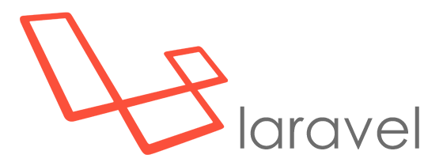

# Curso de Laravel código 46901

> Curso de Laravel |  
> Martes y Jueves 19hs (Arg) |  
> Código: 46901 |  
> sensei: Marcos Pinardi |

1. Definición
2. Requisitos
3. Recursos
4. Instalación
5. Iniciar el server
6. Actualizar desde un proyecto existente

## Definición
> Laravel es uno de los frameworks de código abierto más fáciles de asimilar para PHP.
> El objetivo de Laravel es el de ser un framework que permita el uso de una sintáxis refinada y expresiva para crear código de forma sencilla, evitando el “código espagueti” y permitiendo multitud de funcionalidades.
> Aprovecha todo lo bueno de otros frameworks y utiliza las características de las últimas versiones de PHP.
> Fue creado en 2011 por Taylor Otwell y tiene una gran influencia de frameworks como Ruby on Rails, Sinatra y ASP.NET MVC.  
> Gran parte de Laravel está formado por dependencias, especialmente de Symfony, esto implica que el desarrollo de Laravel dependa también del desarrollo de sus dependencias.

## Requisitos

> De Software

1. un terminal
- [ ] la del sistema operativo
- [ ] cmDer https://cmder.net/
- [ ] Cygwin https://www.cygwin.com/
- [ ] Git Bash

2. Composer
   Composer es un administrador de dependencias en PHP.  
   https://getcomposer.org/  
   https://getcomposer.org/Composer-Setup.exe

## Instalación
> Usando composer vamos a movernos al directorio de trabajo    
> En ese directorio vamos a crear un proyecto (carpeta con toda la magia de laravel) .  
> Con el comando "cd" nos movemos a nuestro directorio de trabajo    
> y luego, con el comando "composer create-project" crearemos un proyecto

`composer create-project laravel/laravel nombre "version"`

> Ejemplo para instalar laravel 6x    
`composer create-project laravel/laravel proyecto "6.*"`

> Ejemplo para instalar laravel (versión más actual según tu versión de PHP)    
`composer create-project laravel/laravel proyecto`

## Iniciando el server
> Nos tenemos que mover a la carpeta del proyecto    
> y en la terminal hacer

`cd proyecto`

> EL MARAVILLOSO MUNDO DE ARTISAN    
> para iniciar al server es el comando

`php artisan serve`

## Actualizar desde un proyecto existente

>Primero hay que descargar el proyecto existente usando git   
>preferntemente.   
>Sino, descargar los archivos de manera tradicional.

> Cuando se descarga de este modo, NO DESCARGA TODO EL PROYECTO.  
> NO descarga por ejemplo el directorio "vendor"

> El comando para clonar todo un proyecto desde git es:

    git clone direccion

> Ejemplo:

    git clone https://github.com/exegeses/laravel-46901.git

> Una vez descargado, vamos a obtener los componetes necesorios para que funcione el framework  
> El comando necesario es "composer update" en el proyecto.

    cd catalogo  
    composer update  

> Cuando haya terminado de descargar y querramos iniciar el proyecto, va a parecer que esta todo funcionando bien, pero aun falta algo.  
> Al intentar editar el archivo de configuración  ".env" nos damos cuenta que no está- sin embargo, hay un archivo. ".env.example"  
> Entonces vamos a generar nuetro archivo ".env" renombrando o compiando este archivo.

> Ahora si, el último paso es genear la key del proyecto.  
> Esto se logra con el comando

    php artisan key:generate

> Ahora ya tenemos nuestro proyecto base listo
> enjoy coding!

